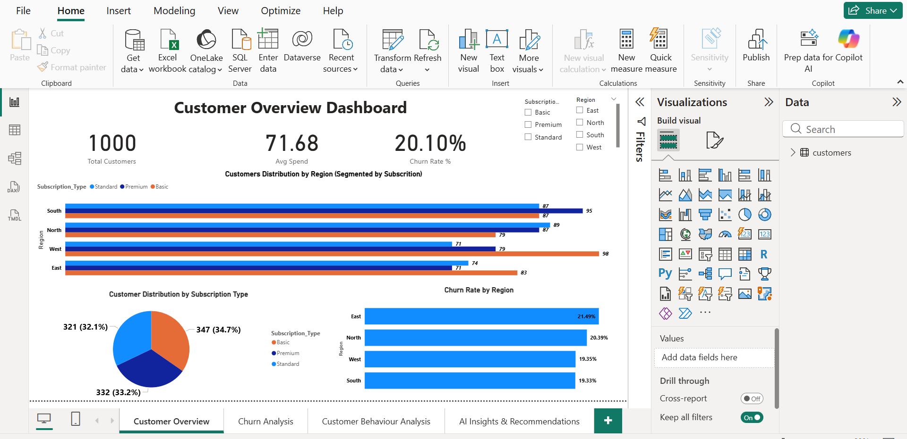
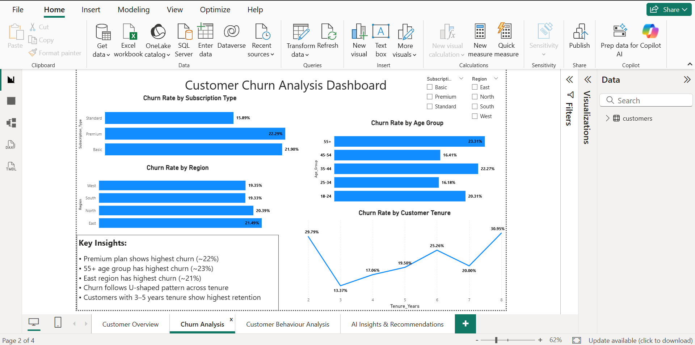
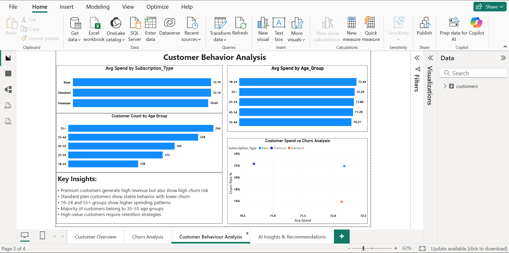
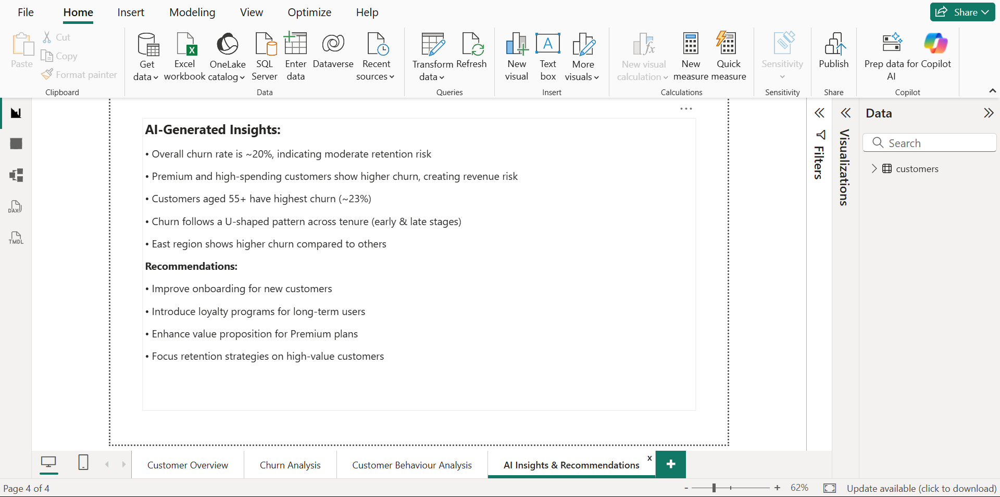

\# 📊 GenAI-Enabled Customer Churn Analysis

\## 📸 Dashboard Preview

## 📊 Dashboard Preview

!\[Page 1](images/page1.png)

!\[Page 2](images/page2.png)

!\[Page 3](images/page3.png)

!\[Page 4](images/page4.png)

\---

\## 🚀 Project Overview

This project analyzes customer churn behavior using SQL and Power BI, enhanced with Generative AI to generate business insights and recommendations.

The goal is to identify key churn drivers, understand customer behavior, and provide actionable insights to improve customer retention.

\---

\## 🎯 Objectives

\* Identify key churn drivers

\* Analyze customer behavior across segments

\* Perform data cleaning and transformation using SQL

\* Build interactive dashboards in Power BI

\* Use Generative AI for insights and recommendations

\---

\## 🛠 Tools \& Technologies

\* SQL (Data Cleaning, Transformation, Analysis)

\* Power BI (Dashboard, DAX, Visualization)

\* Excel (Data Handling)

\* Generative AI (ChatGPT)

\---

\## 📂 Dataset

Customer-level dataset including:

\* Customer\_ID

\* Age, Gender

\* Region

\* Subscription\_Type

\* Monthly\_Spend

\* Last\_Login

\* Customer\_Since

\* Churned

\---

\## 🧹 Data Cleaning

\* Converted data types (Age, Spend, Dates)

\* Handled missing values (Age, Gender, Spend)

\* Standardized categorical values

\* Ensured uniqueness of Customer\_ID

\---

\## ⚙️ Feature Engineering

\* Created Age\_Group segments

\* Derived Tenure\_Years from Customer\_Since

\---

\## 🔍 Key Insights

\* Overall churn rate ≈ 20%

\* Premium customers have highest churn (\~22%)

\* Customers aged 55+ show highest churn (\~23%)

\* East region has highest churn

\* Standard plan has lowest churn

\* U-shaped churn pattern across tenure

\* High-spending customers show higher churn risk

\---

\## 📊 Dashboard Overview

\### 🟢 Customer Overview

\* KPI Cards: Total Customers, Avg Spend, Churn Rate

\* Customer distribution by region and subscription

\### 🔵 Churn Analysis

\* Churn by region, age group, subscription

\* Tenure-based churn analysis

\### 🟣 Customer Behavior

\* Spending patterns

\* High-value customer churn risk

\### 🔴 AI Insights \& Recommendations

\* AI-generated insights

\* Business recommendations

\---

\## 🤖 GenAI Integration

\* Data quality validation

\* Insight generation

\* Business recommendation generation

\---

\## 💡 Business Recommendations

\* Improve onboarding for new customers

\* Retention strategies for long-term customers

\* Enhance premium plan value

\* Target high-risk segments (55+ age group)

\* Address regional churn issues

\---

\## 🧠 One-Line Summary

GenAI-powered churn analysis to identify drivers, analyze behavior, and deliver actionable business insights.

